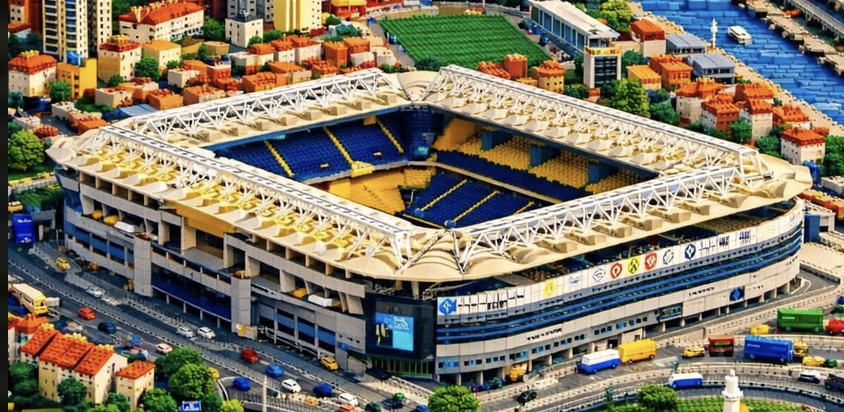
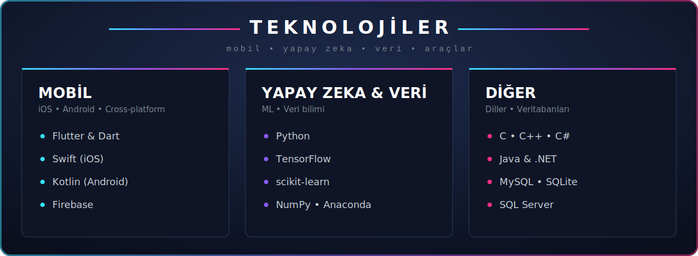
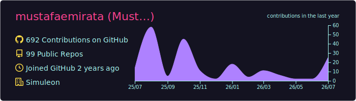
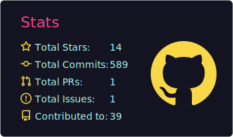
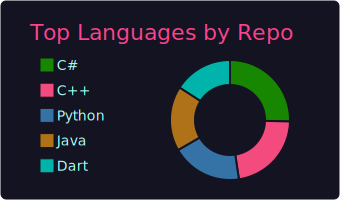
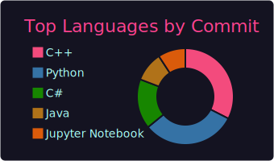
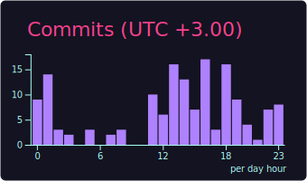

<!--
  KURULUM:
  1. mustafaemirata/mustafaemirata reposunun ana dizinine bu README.md'yi koy
  2. "assets" klasörünü (header.svg + footer.svg) da aynı repoya yükle
  3. Dış servisli kartlar (stats, pixel kart) ilk yüklemede yavaş olabilir — sayfayı yenile
-->

## 🎮 Hakkımda

- 🎓 **Çankırı Karatekin Üniversitesi** — Bilgisayar Mühendisliği 4. sınıf öğrencisiyim
- 📱 **Flutter** ve **Swift** ile mobil uygulamalar geliştiriyorum
- 🤖 **Python** ile yapay zeka destekli mobil uygulamalar üzerinde çalışıyorum
- 🔥 Backend tarafında **Firebase** kullanıyorum
- 🚀 **Google Play** ve **App Store**'da yayında uygulamalarım var

  

## 📊 İstatistikler

<!-- Bu kartlar .github/workflows/profile-cards.yml tarafından repo içinde üretilir: dış servis yok, asla kırılmaz -->

## 🌐 Bana Ulaşın

